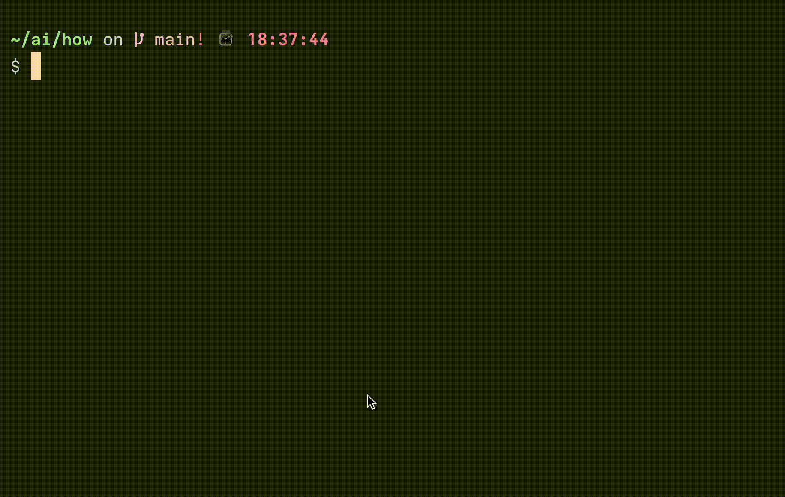

# how-cli

Ask your terminal (AI) about cli commands



Yes, it's just an LLM wrapper. It saves me a lot of time. It will for you too.

## Installation

Run this command to install `how`:

```bash
curl -fsSL https://raw.githubusercontent.com/kynnyhsap/how/main/scripts/install.sh | bash
```

> This will fetch and run the script located in [./scripts/install.sh](/scripts/install.sh).

## Usage

Make sure to set **api key** first with `--key` flag:

```bash
how --key
```


> Default provider is `openai`. You can change it with `--provider` flag. See [providers](#providers) below for more info.

Now you can prompt and adk `how` about cli commands:

```bash
how to [prompt...]
```

### Providers

The default provider is `openai`, but you can change it with `--provider` flag:

```bash
how --provider
```


Changing provider means you also need to update the api key with `--key` flag.

Supported providers:

- [x] `openai` - [OpenAPI GPT](https://chatgpt.com/) models (default)
- [x] `anthropic` - [Anthropic](https://claude.ai/) models
- [x] `groq` - [Groq](https://groq.com/) models
- [x] `ollama` - [Ollama](https://ollama.com/) models, on-device inference, no api key required
- [ ] `custom` - Custom provider script

### Config

Api key and provider info is stored in `~/.how/config.json`. This config is also used for other options. You can view it with:

```bash
how --config
```

### Help

To see all available commands and options:

```bash
how --help
```

## Examples

```bash
how to create a git branch
```

```bash
how to convert video to gif with ffmpeg
```

```bash
how to compile a c file
```


## Development

> You will need [bun](https://bun.sh/) for this.

To install dependencies:

```bash
bun install
```

To run from source:

```bash
bun how [arguments...]
```

To compile executable from source:

```bash
bun compile-dev
```

## Cross-Compile

Thre is a `compile.sh` script to cross-compile for multiple platforms. You can run it with:

```bash
./scripts/compile.sh
```

## Releases

I do releases when I feel like it. There is a script to automate in in `scripts/release.sh`.

Later I will add command to upgrade cli to latest version.

## License

MIT, you can go nuts with it.
